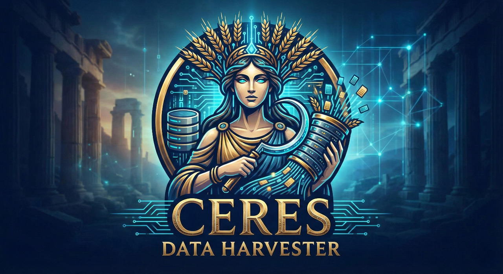
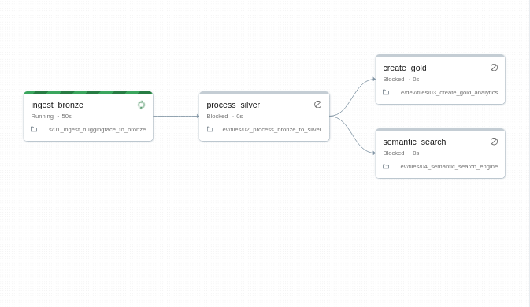
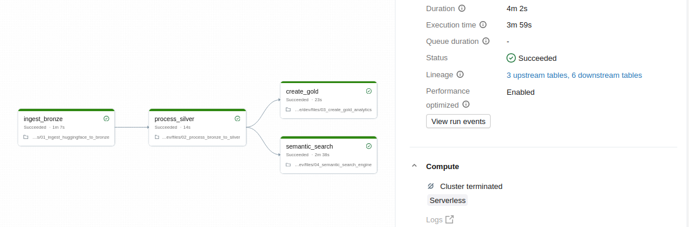
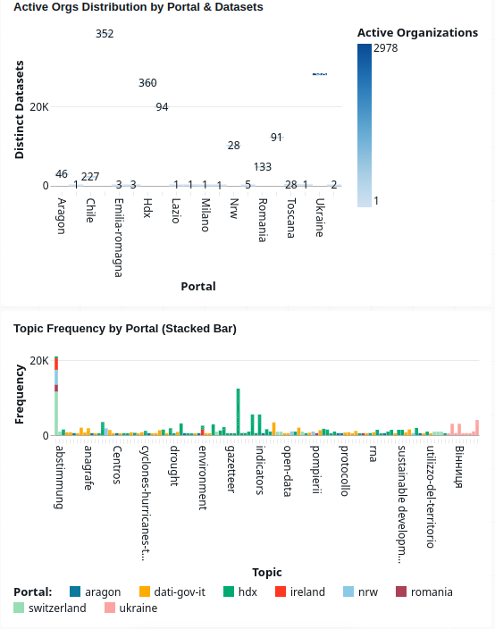

<div align="center">
  
  <h1>Databricks Pipeline for Ceres</h1>
  <p><strong>Medallion Architecture pipeline for open data analytics on Databricks</strong></p>
  <p>
    <a href="https://github.com/AndreaBozzo/Ceres"></a>
    <a href="https://huggingface.co/datasets/AndreaBozzo/ceres-open-data-index"></a>
    <a href="https://github.com/AndreaBozzo/databricks-ceres-pipeline/blob/main/LICENSE"></a>
  </p>
</div>

---

This repository contains the **Databricks** analytics pipeline for the [Ceres](https://github.com/AndreaBozzo/Ceres) project. It implements a **Medallion Architecture** (Bronze → Silver → Gold) that ingests the Ceres open data index from Hugging Face and produces analytics-ready tables plus a lightweight semantic search engine, all running on Databricks.

The Silver and Gold layers are expressed as a **[Lakeflow (Spark) Declarative Pipeline](https://docs.databricks.com/aws/en/ldp/)** — declarative materialized views with built-in data-quality expectations and lineage. The Bronze layer stays a Python task because it pulls from the Hugging Face Hub and keeps a SHA fingerprint to skip unchanged loads.

> **Looking for natural-language discovery?** Ask questions of this index in plain English with the sibling project [**ceres-discovery-agent**](https://github.com/AndreaBozzo/ceres-discovery-agent) (Agent Bricks: Genie + Knowledge Assistant). This repo is the **batch-analytics** layer; that repo is the **search/agent** layer.

## Architecture


## Screenshots





## Components

| Component | Layer | Kind | Description |
|-----------|-------|------|-------------|
| `01_ingest_huggingface_to_bronze.py` | Bronze | Python notebook | Loads the dataset from Hugging Face, coerces types, and writes to a managed Delta table with audit columns. SHA fingerprint skips unchanged loads; a `sample_rows` widget caps rows for cheap test runs |
| `pipeline/ceres_medallion.sql` | Silver + Gold | Lakeflow Declarative Pipeline | Declarative materialized views: dedup/clean Silver (with `EXPECT` data-quality expectations), plus the three Gold analytics tables — monthly trends, topic frequency, and portal statistics |
| `04_semantic_search_engine.py` | Gold / ML | SQL notebook | Builds a TF-IDF feature store and exposes a lightweight hashing-based search with an interactive widget (a no-LLM demo; for real NL discovery use [ceres-discovery-agent](https://github.com/AndreaBozzo/ceres-discovery-agent)) |

## Quick Start

### Prerequisites

- A Databricks workspace ([Free Edition](https://www.databricks.com/learn/free-edition) works for testing; it replaced the retired Community Edition)
- Databricks CLI configured (`databricks auth login`)

### Option A — Databricks Asset Bundles (recommended)

```bash
# Clone and deploy
git clone https://github.com/AndreaBozzo/databricks-ceres-pipeline.git
cd databricks-ceres-pipeline

# Validate the bundle
databricks bundle validate

# Deploy to your workspace
databricks bundle deploy -t dev

# Run the full job (ingest → Lakeflow transforms → search)
databricks bundle run ceres_pipeline -t dev

# Cheap end-to-end smoke run on a 50k-row sample
databricks bundle run ceres_pipeline -t dev --params sample_rows=50000

# On Free Edition, if creating the `main` catalog is denied, fall back:
databricks bundle deploy -t dev --var catalog=workspace
```

### Option B — Manual import

1. Import `01_ingest_huggingface_to_bronze.py` and `04_semantic_search_engine.py` into your workspace
2. Create a Lakeflow pipeline from `pipeline/ceres_medallion.sql` (set the `bronze_table`, `min_valid_year`, and `top_topics_limit` configuration values)
3. Run: notebook `01` → the Lakeflow pipeline → notebook `04`. Notebook `01` installs HuggingFace dependencies automatically via `%pip`

## Configuration

### Databricks Asset Bundle

The pipeline is configured as a [Databricks Asset Bundle](https://docs.databricks.com/dev-tools/bundles/index.html) in [`databricks.yml`](databricks.yml). Targets:

| Target | Description |
|--------|-------------|
| `dev` | Development — runs on your personal workspace folder |
| `prod` | Production — designed for a shared workspace with job scheduling |

### Bundle variables and parameters

No secrets are required — the pipeline reads from a public Hugging Face dataset.

| Name | Kind | Default | Description |
|------|------|---------|-------------|
| `catalog` | bundle var (`--var`) | `main` | Unity Catalog for all layers (use `workspace` on Free Edition if a new catalog is denied) |
| `schema` | bundle var (`--var`) | `ceres` | Schema (database) for all tables |
| `sample_rows` | job param (`--params`) | `0` | Cap Bronze rows for a cheap test run (`0` = full load) |

Dataset identifier and table names are centralized in [`config.py`](config.py); the Silver/Gold table names and analytics knobs (`min_valid_year`, `top_topics_limit`) are also set as pipeline `configuration` in [`databricks.yml`](databricks.yml).

## Delta Tables Produced

Silver and Gold are Lakeflow **materialized views** (Delta-backed); Bronze and the ML features are managed Delta tables written by the notebook tasks.

| Table | Layer | Description |
|-------|-------|-------------|
| `bronze_ceres_metadata` | Bronze | Raw dataset metadata + `ingestion_ts`, `source_system`, `source_sha` |
| `silver_ceres_metadata` | Silver | Cleaned, deduplicated, with parsed timestamps and tag arrays |
| `gold_monthly_trend` | Gold | Monthly dataset ingestion counts by portal |
| `gold_topic_analysis` | Gold | Top 200 topics by frequency across portals |
| `gold_portal_stats` | Gold | Per-portal statistics (dataset count, orgs, date range) |
| `gold_ml_features` | Gold | TF-IDF feature vectors (256-dim) for semantic search |

## Relationship to Ceres

[Ceres](https://github.com/AndreaBozzo/Ceres) is a Rust-based semantic search engine that harvests metadata from CKAN open data portals and indexes them with vector embeddings. This pipeline provides a **complementary analytics layer** on the same data:

- **Ceres** (main repo) → Real-time harvesting, Gemini embeddings, PostgreSQL + pgvector, REST API
- **This pipeline** → Batch analytics, Spark ML features, Delta Lake, Databricks dashboards

Both consume the same [Hugging Face dataset](https://huggingface.co/datasets/AndreaBozzo/ceres-open-data-index) as their source of truth.

## Development

```bash
# Lint notebooks
pip install -r requirements-dev.txt
ruff check .

# Run tests (requires Databricks Connect or a cluster)
pytest tests/
```

## License

Licensed under the [Apache License, Version 2.0](LICENSE).

## Acknowledgments

- [Ceres](https://github.com/AndreaBozzo/Ceres) — the main semantic search engine project
- [Databricks](https://databricks.com/) — unified analytics platform
- [Hugging Face](https://huggingface.co/) — dataset hosting
- [Delta Lake](https://delta.io/) — open-source storage layer
